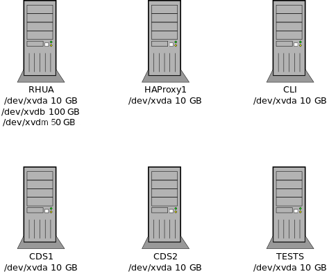
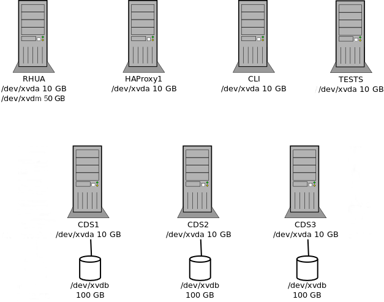

# RHUI3 automation - scripts

## Create Stack script

This script creates EC2 instance machines (m5.large) according to default or specified options.

Instances are named `$user_$fstype_$name_$role` (*user_nfs_77betatests_rhua*)

The script produces an output config file suitable for the RHUI3 ansible installation. [Example](#output-configuration-file) of the output file. Default
name of the file is `hosts_$fstype_$name.cfg` (*hosts_nfs_77betatests.cfg*)

New security group is created. Its name contains stack id. <br />
Inbound rules:

  ```
  22 TCP (SSH)
  53 TCP (DNS)
  53 UDP (DNS)
  80 TCP (HTTP)
  443 TCP (HTTPS)
  2049 TCP (NFS)
  5000 TCP (containers)
  5671 TCP (Qpid)
  8140 TCP (puppet)
  24007 TCP (gluster)
  49152-49154 (gluster)
```

### Requirements

* yaml config file with ec2 credentials - default path is `/etc/rhui_ec2.yaml` [(example)](#input-configuration-file)
* up-to-date lists of AMIs in `*mapping.json` files - the files should be up to date in Git, but you can regenerate them locally with the `scripts/get_amis_list.py` script
* the following modules for your Python version: boto, paramiko; install them using your distribution's package manager, or using pip
* SSH configuration (in `~/.ssh/config`) with the user name and private key for EC2 machines, for example:

```
Host *.amazonaws.com
    User ec2-user
    IdentityFile ~/.ssh/rhatter
    ServerAliveInterval 60
```

Note: if you use your common keypair in EC2, you needn't have the `IdentityFile` line.
The key from the `~/.ssh/id_rsa` file will be used automatically.

See also the note below the yaml config file example regarding the user name and key.

### Usage

Run `scripts/create-cf-stack.py [optional parameters]` [(example)](#usage-example)

Default configuration: 
  * NFS filesystem
  * RHEL7 instances (basic RHUI 3 requirement)
  * eu-west-1 region
  * instances: 1xRHUA (NFS, DNS), 1xCDS, 1xHAProxy

#### Main parameters

  * **--name [name]** - common name for the instances in the stack (as in $user_$fstype_$name_$role); also affects the `hosts` file name (unless overridden). `default = rhui`
  * **--gluster** - use GlusterFS instead of NFS
  * **--cds [number]** - number of CDS machines, `default = 1` (if Gluster filesystem, `default = 3`)
  * **--cli5/6/7/8 [number]** - number of CLI machines, `default = 0`, use `-1` to get machines for all architectures (one machine per architecture)
  * **--cli-all** - get client machines for all RHEL versions
  * **--cli7/8-arch [arch]** - CLI machines' architectures (comma-separated list), `default = x86_64 for all of them`, `cli`_N_ set to `-1` will populate the list with all architectures automatically, so this parameter is unnecessary then
  * **--atomic-cli [number]** - number of ATOMIC CLI machines, `default = 0`
  * **--test** - if specified, TEST machine running RHEL 7, `default = 0`
  * **--test8** - if specified, TEST machine running RHEL 8, `default = 0`
  * **--region [name]** - `default = eu-west-1`
  * **--ansible-ssh-extra-args [args]** - optional SSH arguments for Ansible
  * **--novpc** - use EC2 Classic, not VPC; possibly useful if you're short on Elastic IPs

Run the script with `-h` or `--help` to get a list of all parameters.

Note that RHEL-5 AMIs are not available in all regions;
see the [RHEL 5 mapping file](RHEL5mapping.json).
Attempts to launch a RHEL-5 client in a region that does not have a RHEL-5 AMI will fail.

Moreover, with Ansible 2.4 and newer, it is no longer possible to manage machines with Python older
than 2.6. RHEL 5 has Python 2.4. To avoid failures, the hosts configuration file will be created
with the RHEL-5 client hostname and other data commented out so that it is all visible to you but
ignored by `ansible-playbook`. Other than that, you are free to use the launched RHEL-5 client any
way you want, just be sure to log in as root directly.

Note that RHEL-8 AMIs are missing the unversioned `python` command. This does not affect
the deployment because the _platform Python_ is automatically set in the case of RHEL 8 hosts.

If you specify a non-x86\_64 client architecture, a suitable instance type will be selected
automatically. You cannot use EC2 Classic with some instance types,
e.g. with t4g.micro, which will be selected for arm64. If you use `--novpc` and request an arm64
client, the script will inform you about this incompatibility and quit.

Mutually exclusive options: 

  * **--nfs** - if specified, nfs filesystem with separate machine and NFS volume (100 GB) attached to this machine
  * **--gluster** - if specified, gluster filesystem with an extra volume attached to each CDS (100 GB)
  
Other options:
  * **--debug** - debug info

### Configuration possibilities

#### NFS filesystem

Configuration with NFS filesystem needs at least 1 CDS, 1 HAProxy and RHUA machine. <br />
If there is a separate NFS machine, an extra 100 GB volume is attached to this machine. If not, an extra 100 GB volume is attached to the RHUA machine.
Either way, a 50 GB volume is attached for MongoDB on the RHUA.



#### Gluster filesystem

Configuration with Gluster filesystem needs at least 3 CDS, 1 HAProxy and RHUA machine. <br />
There is an extra 100 GB volume attached to each CDS machine.
In addition, a 50 GB volume is attached for MongoDB on the RHUA.



### Examples

#### Usage example

* `scripts/create-cf-stack.py`
  * basic NFS configuration
  * 1xRHUA=DNS=NFS, 1xCDS, 1xHAProxy
* `scripts/create-cf-stack.py --test --gluster --name playpit`
  * Gluster configuration
  * 1xRHUA=DNS, 3xCDS, 1xHAProxy, 1xtest_machine
* `scripts/create-cf-stack.py --region eu-central-1 --nfs cli6 2 --haproxy 2 --name rhui31wip`
  * NFS configuration in the eu-central-1 region
  * 1xRHUA=DNS, 1xNFS, 2xCLI6, 2xHAProxy
* `scripts/create-cf-stack.py --dns --cds 2 --cli6 1 --cli7 1 --input-conf /etc/rhui_amazon.yaml --output-conf my_new_hosts_config_file.cfg --name cdsdebug`
  * NFS configuration
  * 1xRHUA=NFS, 1xDNS, 2xCDS, 1xCLI6, 1xCLI7, 1xHAProxy
* `scripts/create-cf-stack.py --input-conf rhui_ec2.yaml --name rhel8clients --cli8 -1 --test --vpcid vpc-012345678 --subnetid subnet-89abcdef`
  * NFS configuration
  * custom input configuration file in the current working directory
  * 1xRHUA=NFS=DNS, 1xCDS, 1xHAProxy, 2xCLI8 (x86_64 and ARM64), 1xTEST, overridden VPC and subnet configuration

#### Input configuration file

Create `/etc/rhui_ec2.yaml` from the following template. Consider making the file accessible to you only if you're on a multi-user system.

```
ec2: {ec2-key: AAAAAAAAAAAAAAAAAAAA, ec2-secret-key: B0B0B0B0B0B0B0B0B0B0a1a1a1a1a1a1a1a1a1a1}
ssh:
  ap-northeast-1: [rhatter-ec2-overrides, /home/rhatter/.ssh/rhatter-ec2-overrides.pem]
vpc:
  eu-west-1: [vpc-333, subnet-aaa]

```

Change `ec2-key` and `ec2-secret-key` values to your keys.
Change the VPC and subnet IDs and add them for any other regions you might use.

Note: in this example, a special key pair name and private key file path are specified
for the `ap-northeast-1` region. In that case, the script will use this information
in the generated inventory file so that Ansible can use it when connecting to the machines.
**This key pair name and the corresponding public key must exist in the given AWS region.**
For other (undefined) regions, the inventory file won't contain such information, and Ansible
will honor the saved or default SSH configuration as decribed in the Requirements section.
At the same time, the stack creation script will use your local user name as the AWS key pair
name unless you override it using the `--key-pair-name` option.
It is therefore wise to keep the same key pair in all regions, and name it according to your
local user name. Then you won't need the `ssh` section in the input configuration file at all.

#### Output configuration file

The output configuration file is needed for the RHUI 3 installation orchestrated by Ansible.

Examples of the output file are in the [deployment README](../deploy/README.md) file,
or see the [hosts.cfg](../hosts.cfg) file in the parent directory.

### How to delete stack

Stack can be deleted "all in one" with CloudFormation. On the AWS amazon web page go to the CloudFormation service, mark the stack -> Actions -> Delete stack.

Stack is deleted with all its instances, volumes and the security group.

